#  AWS Day 3 – EC2, S3, User Data, Docker & Private Access


---

##  Overview

This project demonstrates hands-on AWS tasks including:

* EC2 instance creation and SSH access
* S3 integration using IAM Role
* Automation using User Data scripts
* Running Docker containers (Nginx & Apache)
* Secure access to Private EC2 using Bastion Host

---

##  Services Used

* Amazon EC2
* Amazon S3
* IAM (Roles)
* AWS CLI
* Docker

---

#  Task 1: Simple EC2 Instance

##  Steps Performed

* Created Ubuntu EC2 instance in default VPC
* Enabled Public IP
* Created SSH key pair
* Used default Security Group
* Set root volume size to 20GB
* Connected using SSH (Git Bash)

##  Screenshots

### EC2 Instance Created

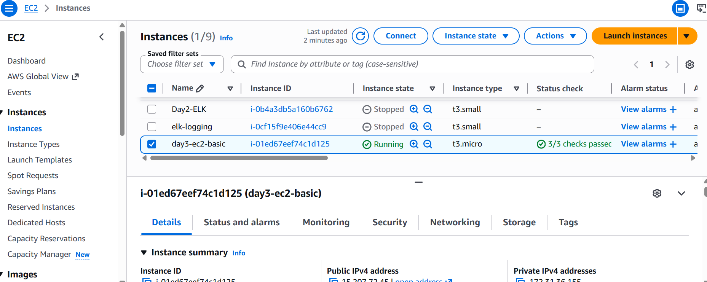

### SSH Connection

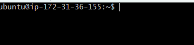

---

#  Task 2: EC2 + S3 + IAM Role

##  Steps Performed

* Installed AWS CLI on EC2
* Created S3 bucket using AWS Console
* Created IAM Role with `AmazonS3FullAccess`
* Attached role to EC2
* Uploaded file to S3

##  Command Used

```bash
aws s3 cp test.txt s3://day3-saroj-bucket/
```

##  Screenshots

### AWS CLI Installed

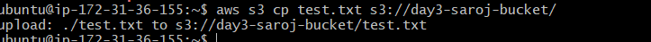

### IAM Role Created

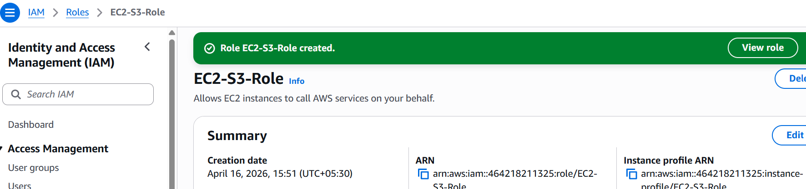

### S3 Upload Success

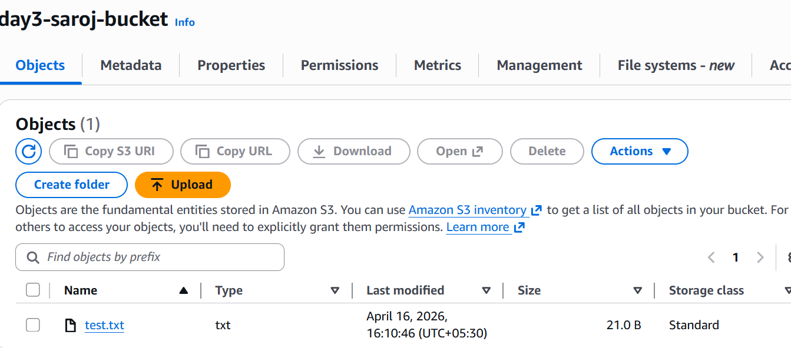

---

#  Task 3: EC2 with User Data

##  Nginx Setup

### User Data Script

```bash
#!/bin/bash
apt update -y
apt install nginx -y
systemctl start nginx
systemctl enable nginx
```

###  Output

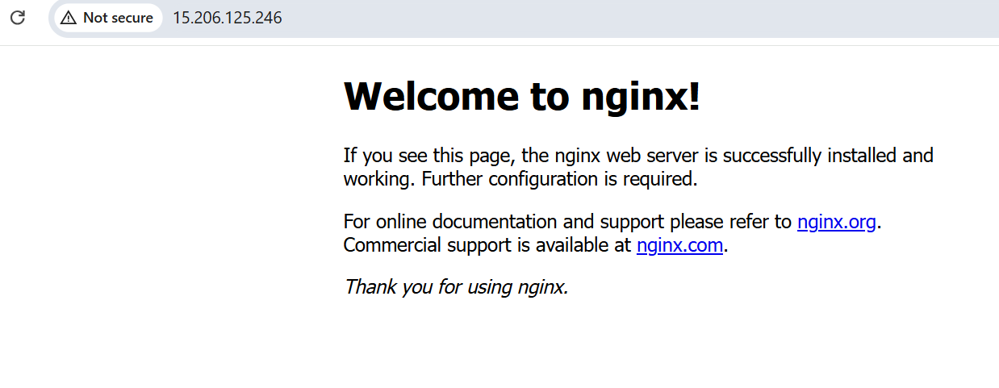

---

##  Docker Setup (Apache + Nginx)

### User Data Script

```bash
#!/bin/bash
apt update -y
apt install docker.io -y
systemctl start docker
systemctl enable docker

docker run -d -p 80:80 --name nginx-container nginx
docker run -d -p 8080:80 --name apache-container httpd
```

###  Outputs

#### Nginx (Port 80)

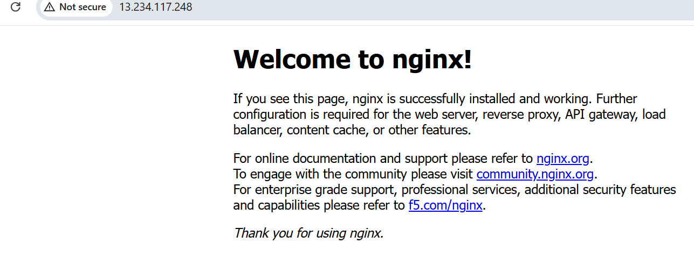

#### Apache (Port 8080)

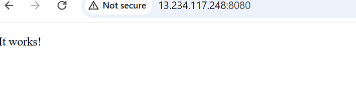

---

#  Task 4: Private EC2 Access using Bastion Host

##  Architecture

```
Your Laptop → Bastion Host → Private EC2
```

---

## Steps Performed

* Created Bastion Host (Public EC2)
* Created Private EC2 (No Public IP)
* Configured Security Group:

  * Bastion → SSH from My IP
  * Private EC2 → SSH only from Bastion Private IP
* Connected to Bastion
* Accessed Private EC2 via Bastion

---

## Screenshots

### Bastion Instance

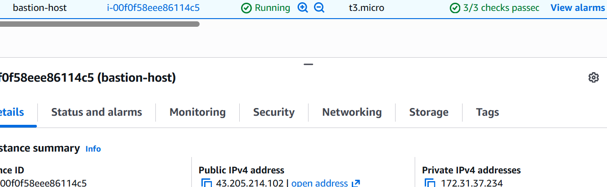

### Private EC2 Instance

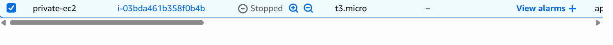

### Security Group Rule

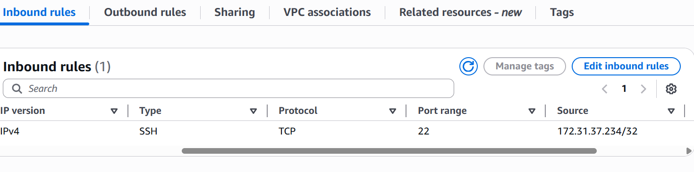

### Bastion SSH

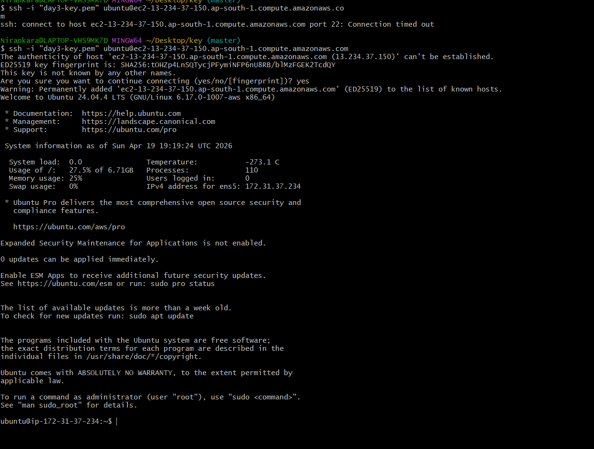

### Private EC2 SSH

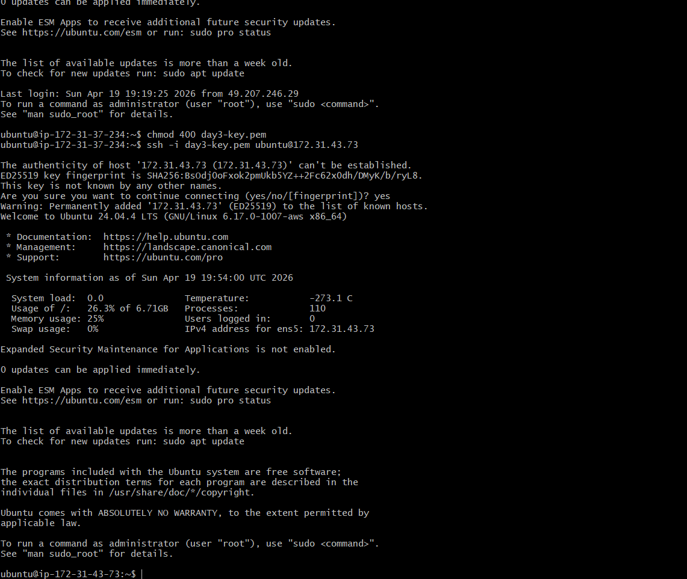

### Architecture Diagram

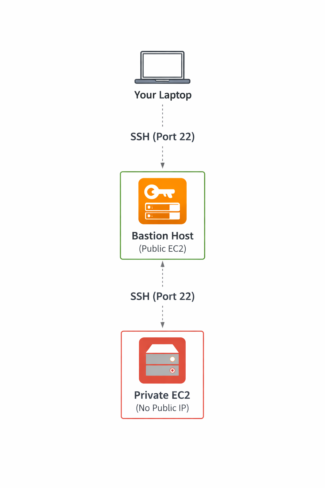

---

#  Key Learnings

* EC2 setup and SSH access
* IAM Role usage instead of credentials
* AWS CLI inside EC2
* Automation using User Data
* Docker container deployment
* Secure architecture using Bastion Host

---

#  Project Structure

```
AWS-Day3/
│
├── screenshots/
│   ├── ec2-instance.png
│   ├── ec2-ssh.png
│   ├── aws-cli.png
│   ├── iam-role.png
│   ├── s3-upload.png
│   ├── nginx-output.png
│   ├── docker-nginx-output.png
│   ├── docker-apache-output.png
│   ├── bastion-instance.png
│   ├── private-ec2-instance.png
│   ├── private-ec2-sg-rule.png
│   ├── bastion-ssh.png
│   ├── private-ec2-ssh.png
│   └── architecture-diagram.png
│
└── README.md
```

---

#  Status

✔ All tasks completed successfully
✔ Verified outputs
✔ Secure architecture implemented

---

#  Conclusion

This project demonstrates real-world AWS and DevOps practices including secure infrastructure design, automation, and containerized deployments.

---
