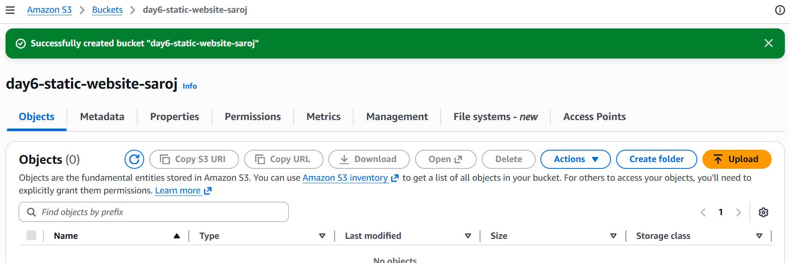
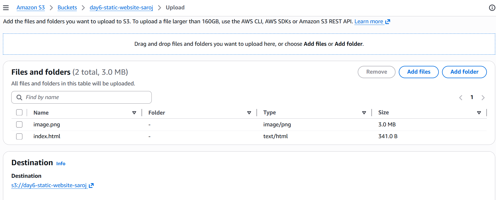
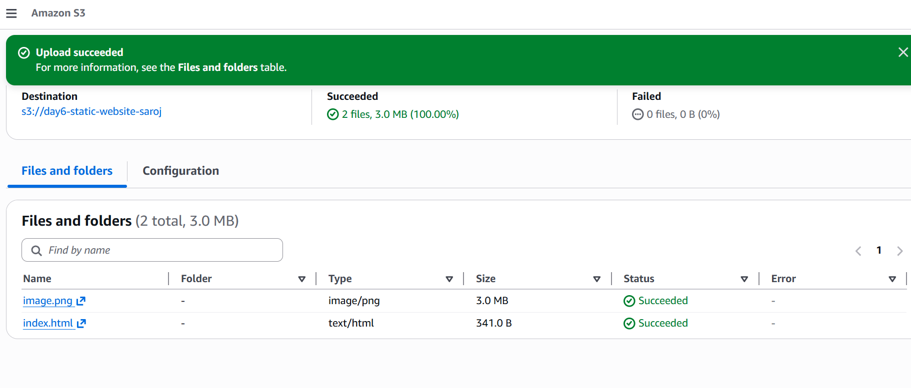
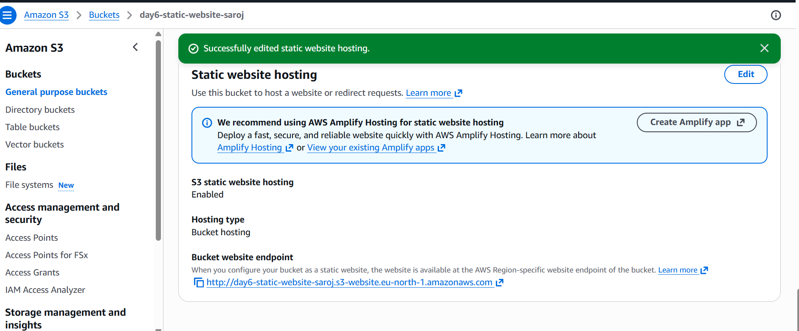
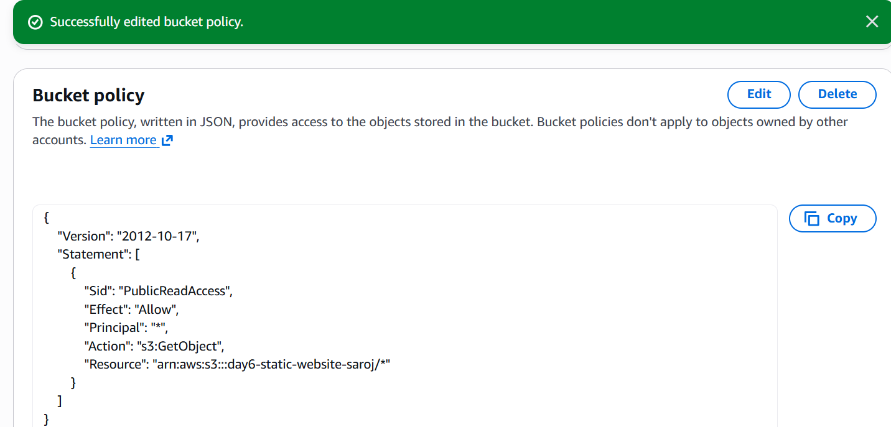
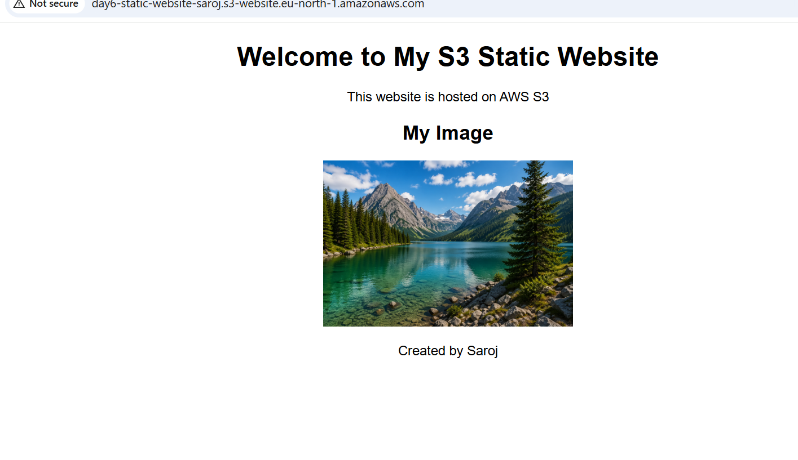
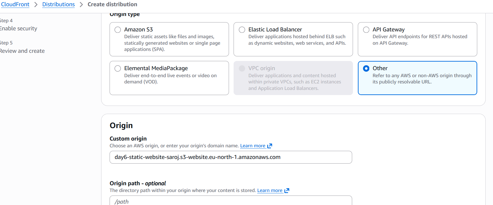
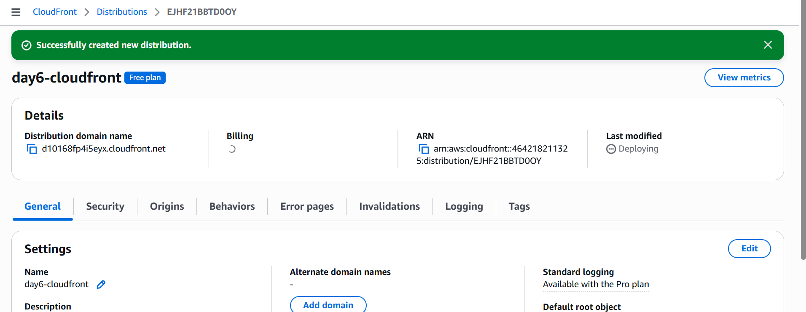
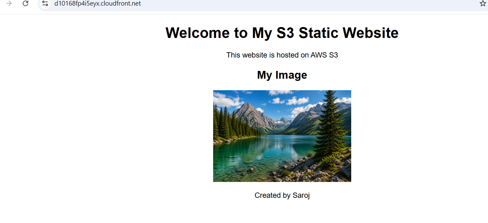

#  AWS Day 6 — Amazon S3 & CloudFront

##  Project Overview

This project demonstrates how to host a static website using Amazon S3 and improve performance using CloudFront CDN.

---

##  Services Used

* Amazon S3 (Static Website Hosting)
* Amazon CloudFront (CDN)

---

##  Architecture

User → CloudFront → S3 (Origin)

---

##  Step 1: Create S3 Bucket

* Created an S3 bucket named `day6-static-website-saroj`
* Disabled Block Public Access
* Configured static website hosting



---

##  Step 2: Upload Files

Uploaded:

* `index.html`
* `image.png`





---

##  Step 3: Enable Static Website Hosting

* Enabled static hosting
* Index document: `index.html`



---

##  Step 4: Bucket Policy

```json
{
  "Version": "2012-10-17",
  "Statement": [
    {
      "Sid": "PublicReadAccess",
      "Effect": "Allow",
      "Principal": "*",
      "Action": "s3:GetObject",
      "Resource": "arn:aws:s3:::day6-static-website-saroj/*"
    }
  ]
}
```



---

##  Step 5: Access Website via S3

* Verified website using S3 endpoint
* Image and content loaded successfully



---

## 10 S3 Bucket Policies:

## 1.Public Read Access

```json
{
  "Effect": "Allow",
  "Principal": "*",
  "Action": "s3:GetObject",
  "Resource": "arn:aws:s3:::day6-static-website-saroj/*"
}
```

## 2.Deny Delete

```json
{
  "Effect": "Deny",
  "Principal": "*",
  "Action": "s3:DeleteObject",
  "Resource": "arn:aws:s3:::day6-static-website-saroj/*"
}
```

## 3.Allow Only Specific IP

```json
{
  "Effect": "Allow",
  "Principal": "*",
  "Action": "s3:GetObject",
  "Resource": "arn:aws:s3:::day6-static-website-saroj/*",
  "Condition": {
    "IpAddress": {
      "aws:SourceIp": "192.168.1.1/32"
    }
  }
}
```

## 4.Deny if Not HTTPS

```json
{
  "Effect": "Deny",
  "Principal": "*",
  "Action": "s3:*",
  "Resource": "arn:aws:s3:::day6-static-website-saroj/*",
  "Condition": {
    "Bool": {
      "aws:SecureTransport": "false"
    }
  }
}
```

## 5.Allow Only IAM User

```json
{
  "Effect": "Allow",
  "Principal": {
    "AWS": "arn:aws:iam::account-id:user/day6-user"
  },
  "Action": "s3:*",
  "Resource": "arn:aws:s3:::day6-static-website-saroj/*"
}
```

## 6.Read-Only Access

```json
{
  "Effect": "Allow",
  "Principal": "*",
  "Action": ["s3:GetObject"],
  "Resource": "arn:aws:s3:::day6-static-website-saroj/*"
}
```

## 7. Deny Public Write

```json
{
  "Effect": "Deny",
  "Principal": "*",
  "Action": ["s3:PutObject"],
  "Resource": "arn:aws:s3:::day6-static-website-saroj/*"
}
```

## 8.Allow Specific Folder Only

```json
{
  "Effect": "Allow",
  "Principal": "*",
  "Action": "s3:GetObject",
  "Resource": "arn:aws:s3:::day6-static-website-saroj/images/*"
}
```

## 9.Time-Based Access

```json
{
  "Effect": "Allow",
  "Principal": "*",
  "Action": "s3:GetObject",
  "Resource": "arn:aws:s3:::day6-static-website-saroj/*",
  "Condition": {
    "DateGreaterThan": {
      "aws:CurrentTime": "2026-01-01T00:00:00Z"
    }
  }
}
```

## 10.Restrict by Referer

```json
{
  "Effect": "Allow",
  "Principal": "*",
  "Action": "s3:GetObject",
  "Resource": "arn:aws:s3:::day6-static-website-saroj/*",
  "Condition": {
    "StringLike": {
      "aws:Referer": "https://example.com/*"
    }
  }
}
```


##  Step 6: Setup CloudFront

* Created CloudFront distribution
* Used S3 website endpoint as origin
* Set protocol policy to HTTP only





---

##  Step 7: Access via CloudFront

* Accessed website using CloudFront URL
* Content delivered via CDN



---

##  Key Learnings

* Static website hosting using S3
* Bucket policies and public access
* CDN caching using CloudFront
* Troubleshooting errors (403, 504)

---

##  Conclusion

Successfully deployed a static website using S3 and improved performance using CloudFront CDN.

---
