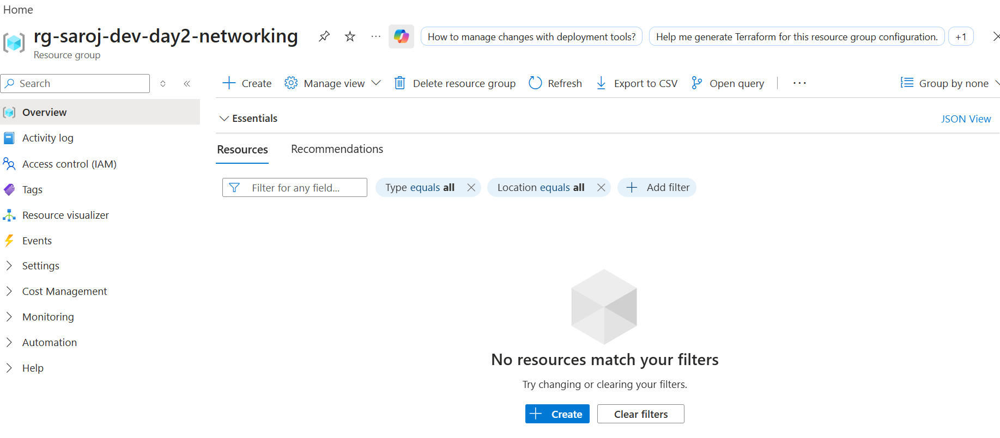
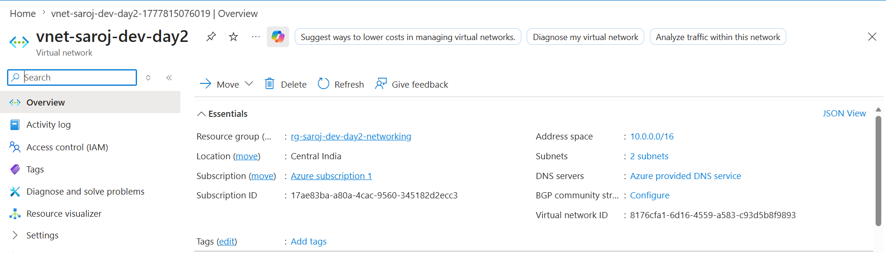
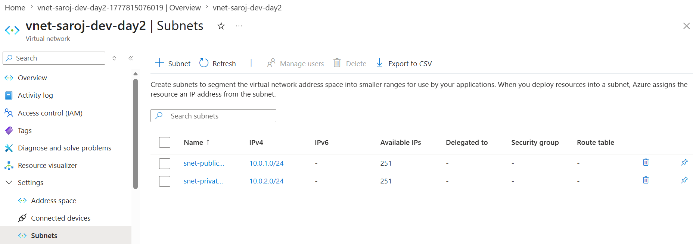
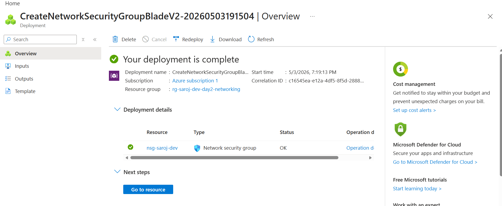
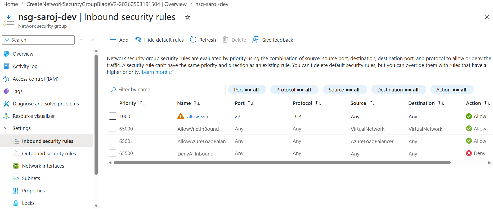
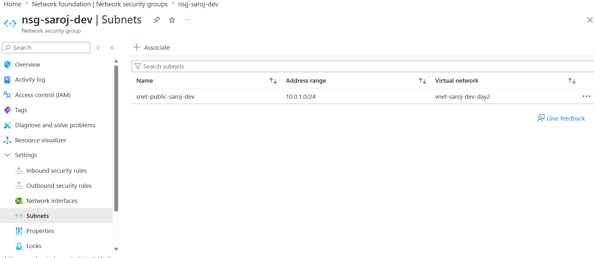
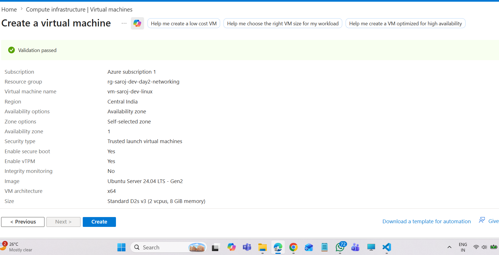
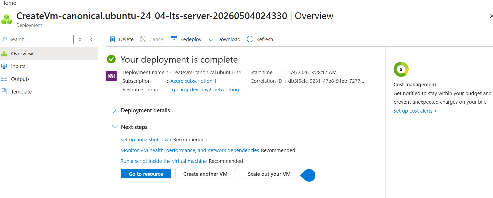
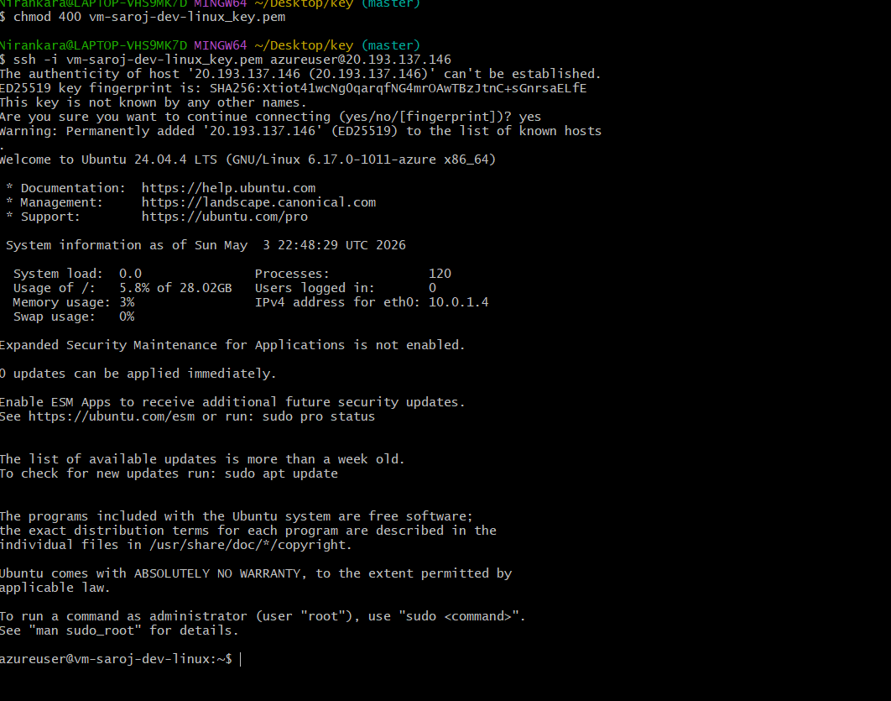
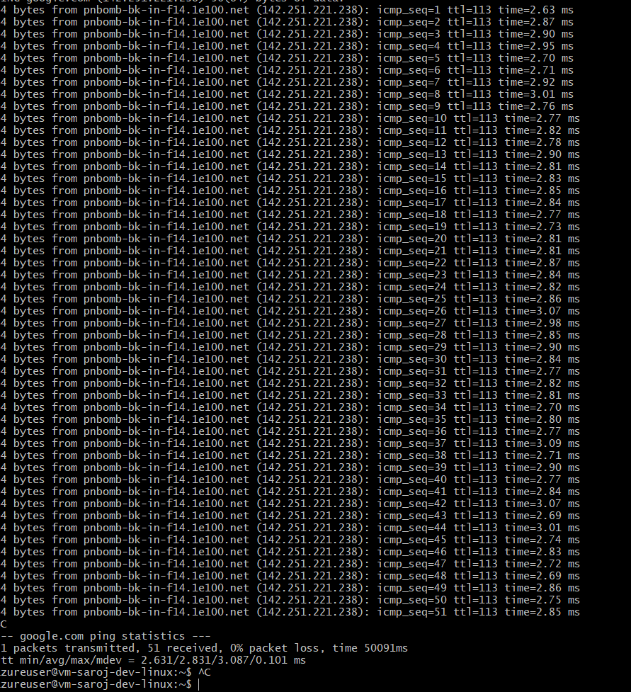

#  Azure Day 2 — Networking Lab

##  Overview

This lab demonstrates how to design and implement Azure networking components, including Virtual Network (VNet), subnets, Network Security Groups (NSG), and Virtual Machine (VM) deployment. It also verifies connectivity using SSH and network testing.

---

##  Services Used

* Azure Virtual Network (VNet)
* Subnets (Public & Private)
* Network Security Group (NSG)
* Azure Virtual Machine (Linux)
* Public IP
* SSH (Secure Shell)

---

##  Architecture

VNet → Subnets → NSG → VM → Internet Connectivity

---

##  Naming Convention Used

| Resource Type  | Name                         |
| -------------- | ---------------------------- |
| Resource Group | rg-saroj-dev-day2-networking |
| VNet           | vnet-saroj-dev-day2          |
| Public Subnet  | snet-public-saroj-dev        |
| Private Subnet | snet-private-saroj-dev       |
| NSG            | nsg-saroj-dev                |
| VM             | vm-saroj-dev-linux           |

---

##  Step-by-Step Implementation

### 1️ Resource Group Creation

Created a resource group to organize all networking resources.

---

### 2️ Virtual Network (VNet)

Created VNet with address space `10.0.0.0/16`.

---

### 3️ Subnet Configuration

Created two subnets:

* Public Subnet → `10.0.1.0/24`
* Private Subnet → `10.0.2.0/24`

---

### 4️ Network Security Group (NSG)

Created NSG to control inbound and outbound traffic.

---

### 5️ NSG Inbound Rule

Configured rule to allow SSH access (Port 22).

---

### 6️ NSG Association

Associated NSG with the public subnet.

---

### 7️ Virtual Machine Creation

Deployed Linux VM inside public subnet.

---

### 8️ VM Deployment

VM successfully deployed and running.

---

### 9️ SSH Connection

Connected to VM using Git Bash via SSH.

---

### 10 Network Connectivity Test

Verified internet access from VM using ping.

---

##  Key Learnings

* Understanding Azure Virtual Network architecture
* Difference between public and private subnets
* Configuring and applying NSG rules
* Secure VM access using SSH
* Verifying network connectivity in cloud environments

---

##  Challenges Faced

* VM size availability issues in selected region
* Understanding Azure UI changes (tab-based navigation)
* SSH key-based authentication setup

---

##  Outcome

Successfully deployed and configured Azure networking infrastructure and verified end-to-end connectivity.

---
