#  Azure Day 5 – Storage (Data Foundation)

##  Objective

To understand Azure Storage architecture by implementing:
- Storage Account creation
- Blob Storage (object storage)
- Lifecycle management (cost optimization)
- Security configuration (SAS-based access)

This lab focuses on how cloud storage acts as the **data foundation for modern applications**.

---

#  1. What is Azure Storage?

Azure Storage is a cloud service used to store and manage data such as files, logs, backups, and application data.

###  What I learned:
- Storage is not just file storage
- It is a scalable, distributed data layer for applications

###  Why it is important:
- Every cloud application depends on storage
- Ensures durability, availability, and scalability

###  When it is used:
- File uploads in web apps
- Backup systems
- Data lakes and analytics systems

---

#  2. Storage Account Creation

###  What I did:
Created an Azure Storage Account using:
- Standard performance tier
- LRS (Locally Redundant Storage)

###  Why I did it:
Storage Account is the **top-level container** for all Azure storage services.

###  How I did it:
Azure Portal → Storage Accounts → Create → Configure → Deploy

###  Screenshot:
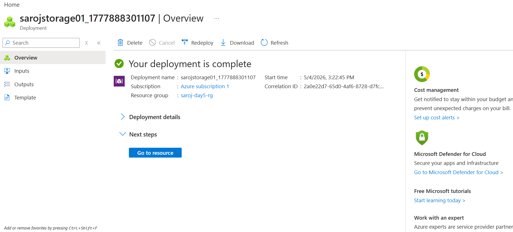

---

#  3. Blob Storage (Object Storage)

###  What I did:
- Created a private container
- Uploaded a test file (`testfile.txt`)

###  Why I did it:
Blob storage is used for **unstructured data (images, files, logs)** in real applications.

###  When it is used:
- Website file uploads
- Media storage (images/videos)
- Backup storage

###  How it works:
Storage Account → Container → Blob

###  Screenshots:
- 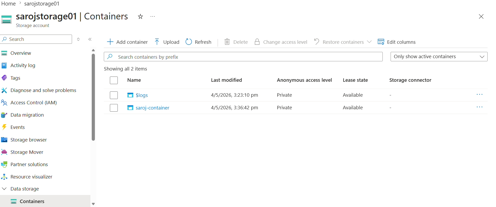

- 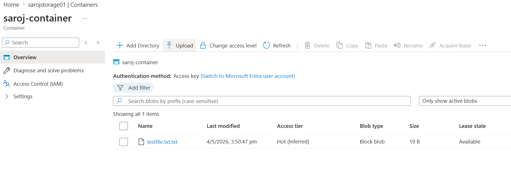

---

#  4. Lifecycle Management

###  What I did:
Created lifecycle rules:
- Move to Cool after 30 days
- Move to Archive after 90 days
- Delete after 180 days

###  Why I did it:
To **automatically reduce storage cost** without manual intervention.

###  When it is used:
- Log management
- Backup retention
- Old file archiving

###  Screenshot:
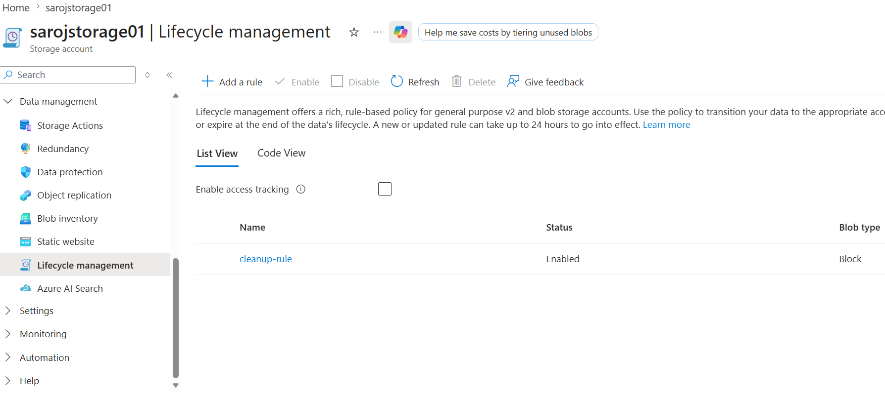

---

#  5. Security Configuration

###  What I did:
- Disabled public access to blobs
- Enabled secure transfer (HTTPS only)

###  Why I did it:
To ensure **data security and prevent unauthorized access**

###  When it is required:
- Production environments
- Sensitive data storage

###  Screenshot:
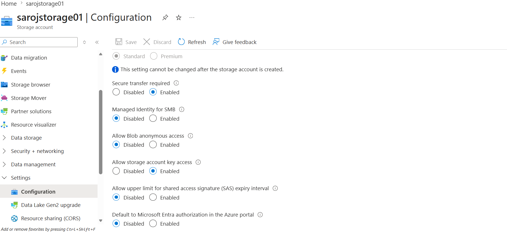

---

#  6. SAS (Shared Access Signature)

###  What I did:
Generated SAS token with:
- Blob access
- Read/List permissions
- Expiry time (time-bound access)

###  Why I did it:
To provide **secure temporary access without exposing storage keys**

###  When it is used:
- File sharing links
- Temporary application access
- Secure downloads/uploads

###  Screenshot:
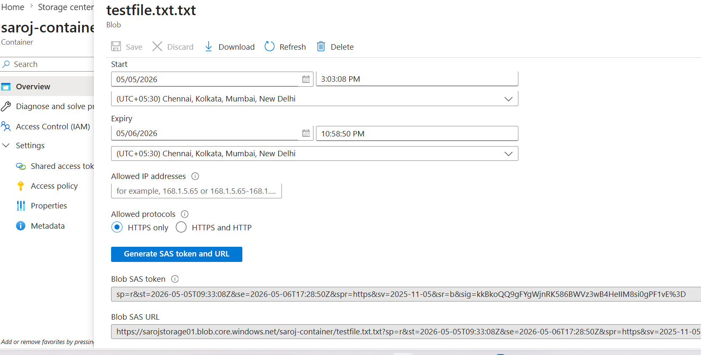

### SAS Access Verification

###  What I did:
- Opened the generated SAS URL in browser

###  What I verified:
- Blob content was accessible using SAS link
- Access worked without exposing storage keys

###  Screenshot:
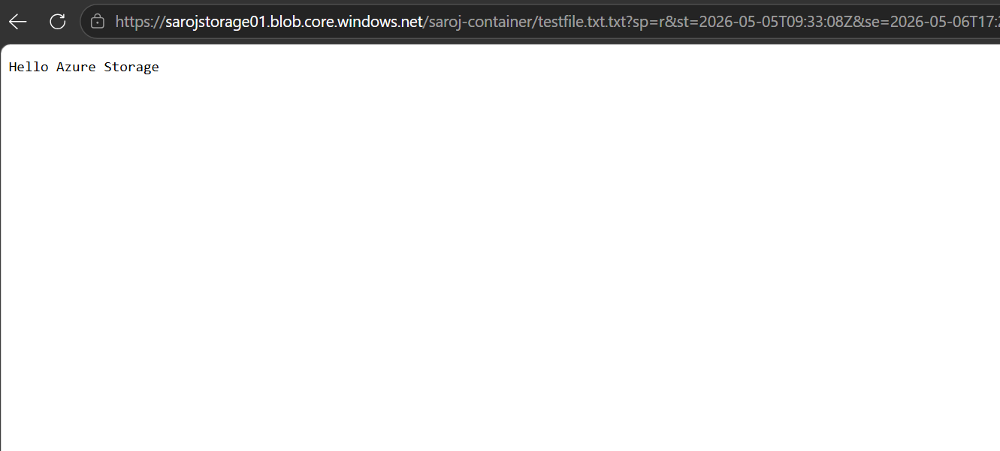

---

#  Security Best Practices I Followed

- Disabled anonymous public access
- Used SAS instead of account keys
- Enabled HTTPS-only communication
- Applied least privilege access

---

#  Key Learnings

- Azure Storage is the foundation of cloud architecture
- Blob Storage is used for unstructured data
- Lifecycle rules help optimize cost automatically
- SAS provides secure, time-bound access
- Security must be enforced at storage level

---

#  Final Outcome

Successfully implemented a full Azure Storage workflow including:
- Resource provisioning
- Data upload
- Cost optimization
- Security configuration

This builds a strong foundation for DevOps and Cloud Engineering roles.

---

#  Azure Day 5 – Lab 2 (VM + Managed Identity)

##  Objective

To securely access Azure Storage without using keys or passwords by implementing:
- Virtual Machine (VM)
- Managed Identity
- Role-Based Access Control (RBAC)
- Azure CLI authentication

---

#  7. Virtual Machine Creation

###  What I did:
- Created an Ubuntu VM
- Enabled SSH access
- Configured Public IP

###  Screenshot:
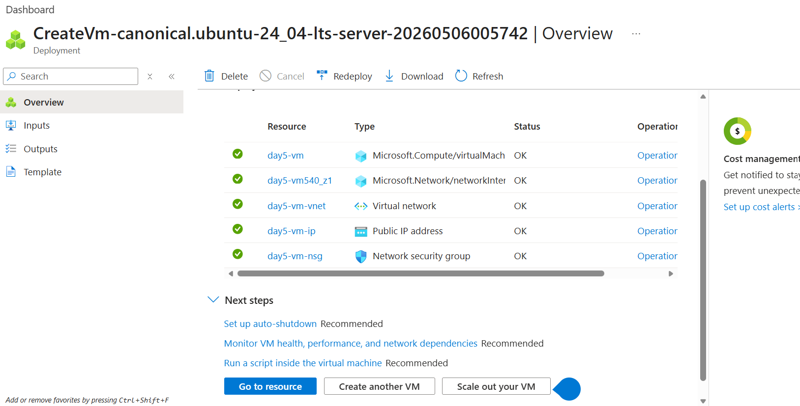

---

#  8. Managed Identity

###  What I did:
- Enabled System Assigned Managed Identity on VM

###  Why:
To allow secure authentication without credentials

###  Screenshot:
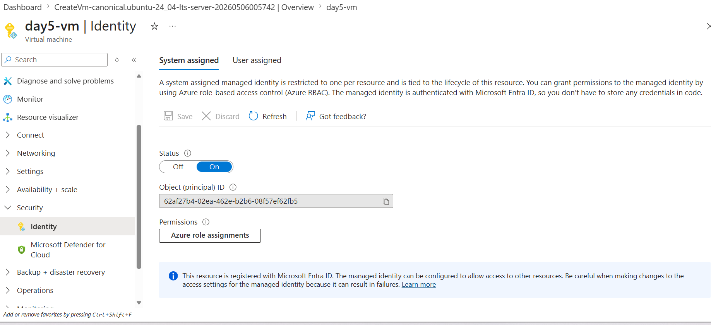

---

#  9. RBAC Role Assignment

###  What I did:
- Assigned **Storage Blob Data Contributor** role to VM

###  Why:
To allow VM to upload blobs securely

###  Screenshot:
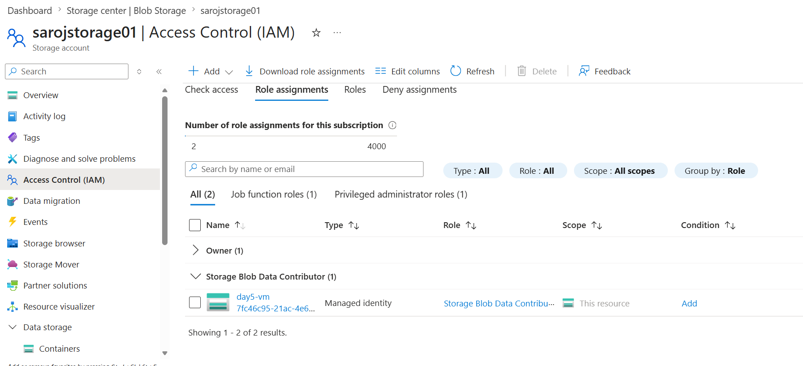

---

#  10. Azure CLI Login (Identity)

###  What I did:
Logged in using:

az login --identity

###  Why I did it:
 To authenticate securely without manual login or credentials

### Screenshot: 
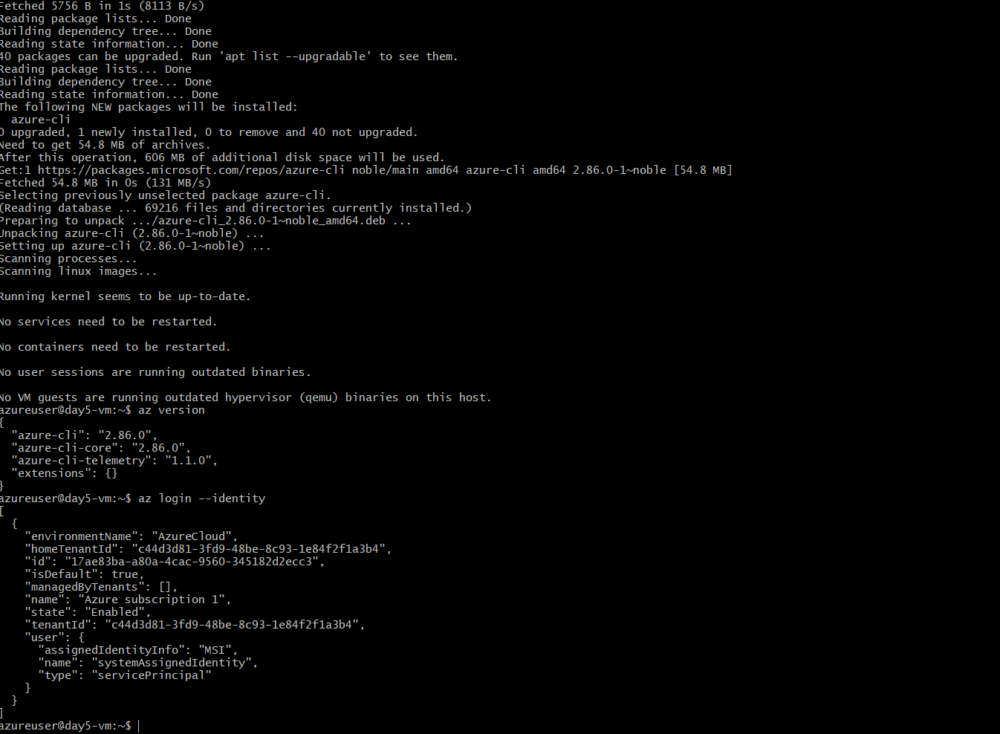

---

#  11. Blob Upload using Managed Identity

###  What I did:
- Created a file named `identityfile.txt`
- Uploaded the file to Azure Blob Storage using Azure CLI

- echo "Hello from Managed Identity" > identityfile.txt

 az storage blob upload \
  --account-name sarojstorage01 \
  --container-name saroj-container \
  --name identityfile.txt \
  --file identityfile.txt \
  --auth-mode login

###  What I did:
To verify secure storage access without using storage keys.

### Screenshot:
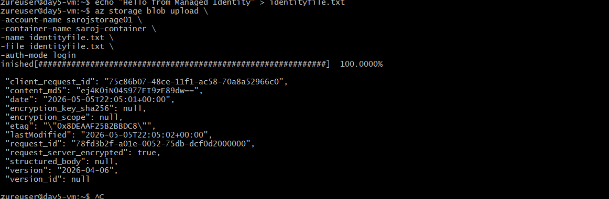

---

#  12. Final Verification

###  What I did:
- Verified both blobs inside Azure Storage container

###  Why I did it:
- To confirm successful execution of storage upload using Managed Identity

###  Screenshot:
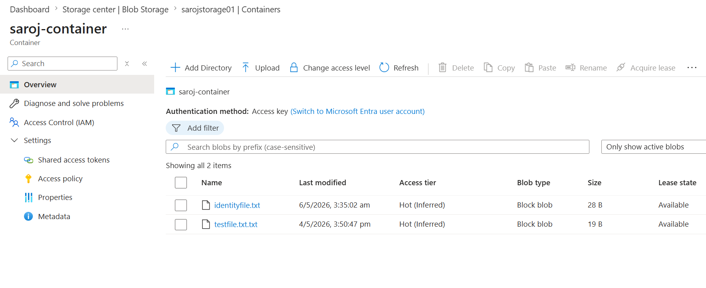

 # Key Learnings
- Managed Identity removes need for secrets
- RBAC provides secure access control
- Azure CLI supports identity-based authentication
- Cloud security follows Zero-Secret architecture

Real DevOps systems avoid hardcoded credentials

---

#  13. Final Outcome

###  What I did:
- Successfully completed Azure Storage setup (Lab 1)
- Implemented secure VM-based access using Managed Identity (Lab 2)
- Configured RBAC and identity-based authentication
- Verified end-to-end secure blob upload workflow

###  Why I did it:
- To demonstrate a complete Azure storage + security workflow using best practices

# Successfully implemented:

- Azure Storage setup (Lab 1)
- Secure VM-based access (Lab 2)
- Identity-based authentication
- RBAC security model
- Real-world cloud security workflow
 

---

