# Terraform Day1 – Azure Resource Group Deployment

##  Objective
To install Terraform, configure Azure authentication, and deploy an Azure Resource Group using Infrastructure as Code (IaC). Also understand lifecycle operations like create, modify, destroy, and alias setup.

---

##  Tools Used
- Terraform
- Azure CLI
- Git Bash
- VS Code
- Microsoft Azure Portal

---

##  Terraform Installation Verification

```bash
terraform -version
```

Output:
```
Terraform v1.15.2 on windows_amd64
```

---

##  Azure Authentication

```bash
az login
```

Selected subscription:
- Azure subscription 1

---

##  Terraform Provider Configuration

```hcl
terraform {
  required_providers {
    azurerm = {
      source  = "hashicorp/azurerm"
      version = "4.72.0"
    }
  }
}

provider "azurerm" {
  features {}
  subscription_id = "YOUR-SUBSCRIPTION-ID"
}
```

---

##  Resource Created

```hcl
resource "azurerm_resource_group" "demo" {
  name     = "rg-terraform-demo"
  location = "Central India"
}
```

---

##  Terraform Workflow

### Initialize Terraform
```bash
terraform init
```

### Validate Configuration
```bash
terraform validate
```

### Format Code
```bash
terraform fmt
```

### Check Execution Plan
```bash
terraform plan
```

### Deploy Infrastructure
```bash
terraform apply
```

### Destroy Infrastructure
```bash
terraform destroy
```

---

##  Terraform State Commands

```bash
terraform state list
terraform show
terraform refresh
```

---

##  Azure Verification

Resource verified in:

https://portal.azure.com

---

##  Terraform Behavior Insight

- Terraform uses **declarative configuration**
- Some changes require **resource replacement**
- Example:
  - `rg-terraform-demo → rg-terraform-dev`
  - Results in destroy + recreate

---

##  Bash Alias Setup (Terraform Shortcut)

To improve productivity, a bash alias was created:

```bash
alias tf=terraform
```

### Verification
```bash
tf -version
```

Output:
```
Terraform v1.15.2 on windows_amd64
```

Now Terraform commands can be run as:
- tf init
- tf plan
- tf apply
- tf destroy

---

##  Screenshots

### Terraform Init
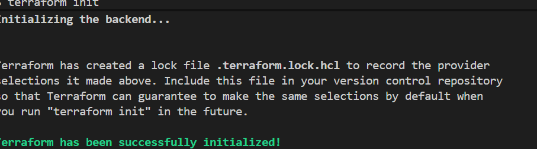

### Terraform Plan
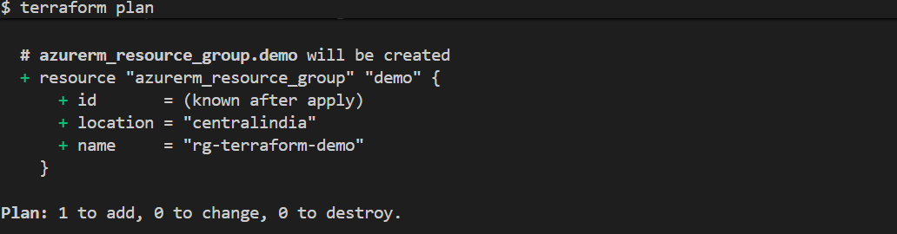

### Terraform Apply
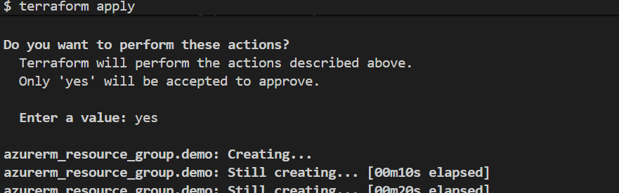  

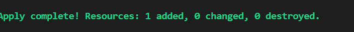

### Resource Group Created
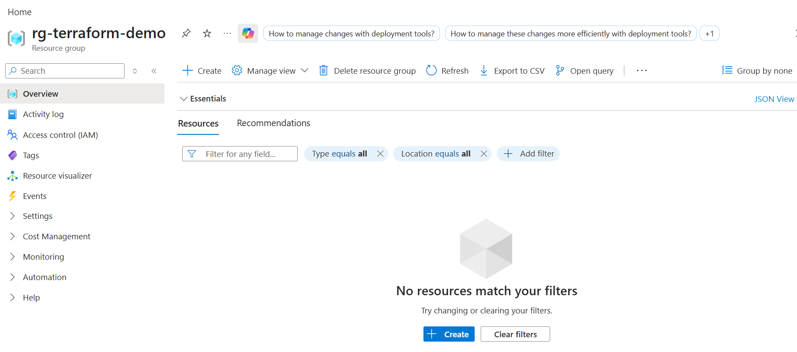

### Terraform Plan Modification (Replace Behavior)
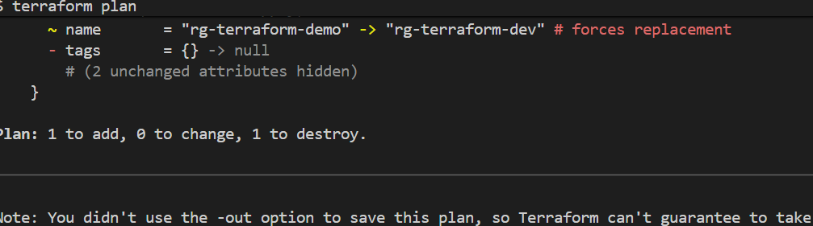

### Terraform Apply Modification
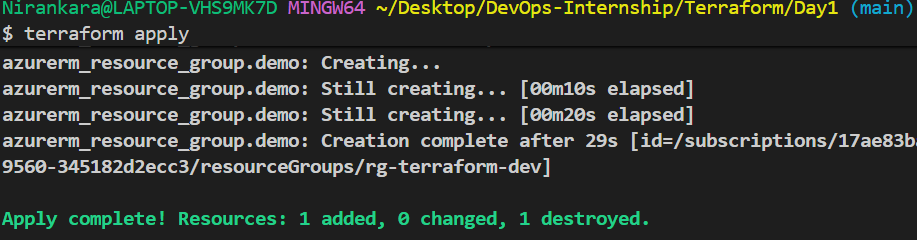

### Modificd Resource Group Created
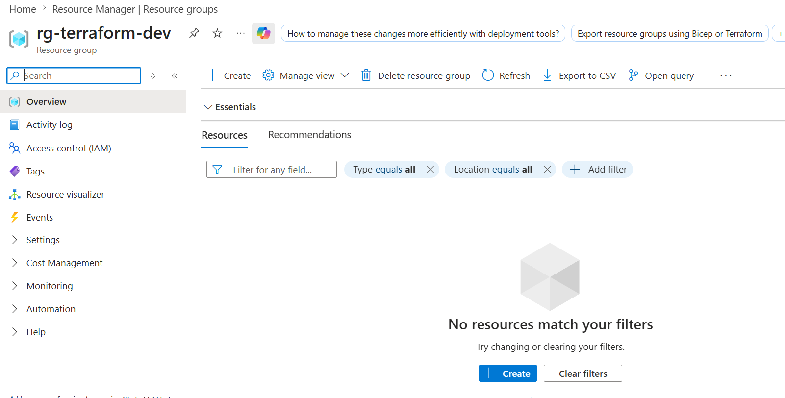


### Terraform Destroy
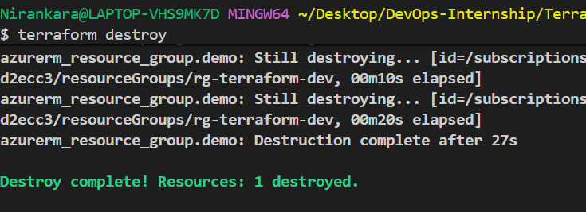

### Azure After Destroy
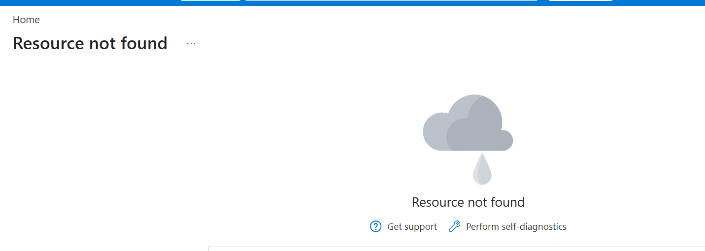

### Terraform Alias Working
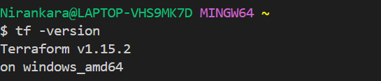

---

##  Key Learnings

- Installed Terraform on Windows
- Configured Azure Provider
- Authenticated using Azure CLI
- Understood Terraform lifecycle:
  - init → plan → apply → destroy
- Learned state management
- Understood resource replacement behavior
- Created bash alias for productivity
- Verified infrastructure in Azure Portal

---

##  Key Points

- Terraform is Infrastructure as Code (IaC)
- `plan` shows execution preview
- `apply` executes changes
- `state` tracks real infrastructure
- Some changes require recreation (immutable resources)
- Alias improves DevOps productivity
- Terraform ensures consistency between code and cloud

---

##  Status

✔ Terraform Installed  
✔ Azure CLI Configured  
✔ First Resource Deployed  
✔ Resource Modified  
✔ Resource Destroyed  
✔ Alias Configured (`tf`)  
✔ Full Terraform Lifecycle Completed  

---
