#  Terraform Day-2 Lab – AWS Infrastructure Automation

---

#  Project Overview

This project demonstrates **Infrastructure as Code (IaC)** using Terraform to provision AWS resources in a real cloud environment.

It covers Terraform fundamentals including variables, locals, remote backend, outputs, and secure state management.

---

#  Why This Project Was Done

This lab was created to simulate real-world DevOps practices:

- Automate AWS infrastructure provisioning
- Avoid manual configuration errors
- Manage infrastructure as reusable code
- Implement remote state management
- Demonstrate Terraform best practices

---

#  How It Was Implemented

## 1. Terraform Project Setup
- Created project structure in VS Code
- Initialized Terraform configuration files

## 2. Variables Implementation
Used multiple variable types:
- string → aws_region, instance_type
- number → instance_count
- bool → enable_monitoring
- list → security_group_ports
- map → common_tags

## 3. Locals Block
Used for:
- Naming conventions
- Tag standardization
- Reusable expressions

## 4. Remote Backend (Manual Setup)
- S3 bucket created for Terraform state storage
- DynamoDB table created for state locking
- Configured in `backend.tf`

## 5. Infrastructure Deployment
Provisioned using Terraform:
- 2 EC2 instances (t3.micro)
- Security Group (ports 22, 80, 443)
- Application S3 bucket

## 6. Outputs
Displayed important information:
- EC2 public IPs
- Security Group ID
- S3 bucket name

## 7. Sensitive Variables
- Used `sensitive = true` for DB password
- Ensured secure output masking

---

#  Infrastructure Created

| Resource | Purpose |
|---|---|
| EC2 Instances (2) | Compute servers |
| Security Group | Network firewall rules |
| S3 Bucket | Application storage |
| S3 Backend Bucket | Terraform state storage |
| DynamoDB Table | State locking |

---

#  Variables Used

| Variable | Type | Description |
|---|---|---|
| aws_region | string | AWS region |
| instance_type | string | EC2 instance type |
| instance_count | number | Number of instances |
| enable_monitoring | bool | Enable EC2 monitoring |
| security_group_ports | list | Inbound ports |
| common_tags | map | Standard tags |
| db_password | string (sensitive) | Secure password |
| ami_id | string | Amazon Machine Image ID |

---

#  Screenshots

All screenshots are available in the `/screenshots` folder:

## 1. S3 Backend Bucket
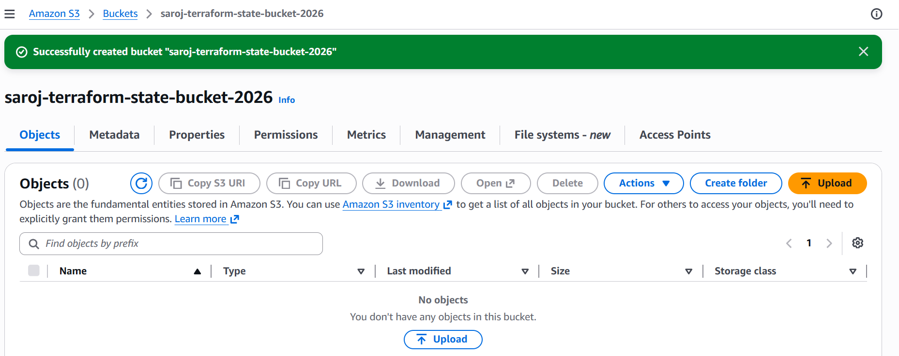

## 2. DynamoDB Lock Table
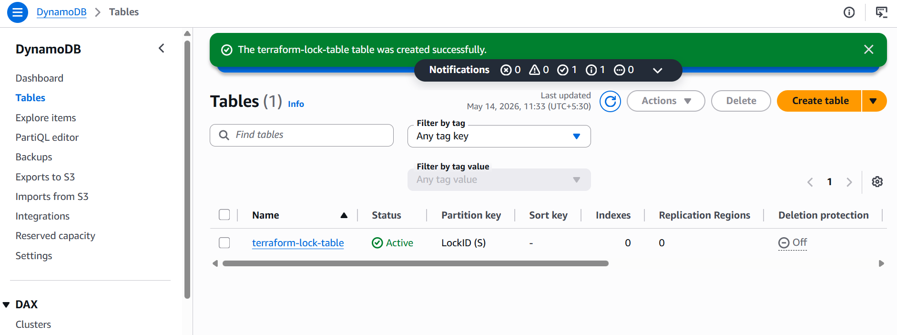

## 3. Terraform Init
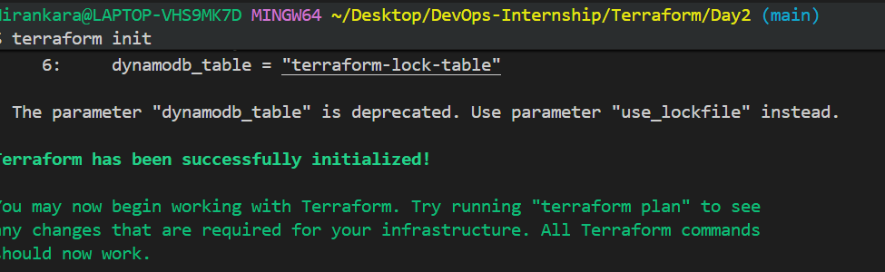

## 4. Terraform Validate
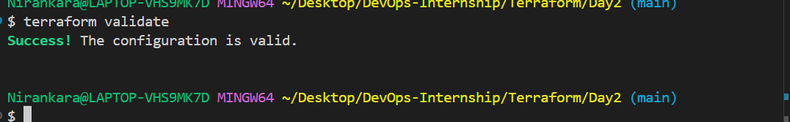

## 5. Terraform Plan
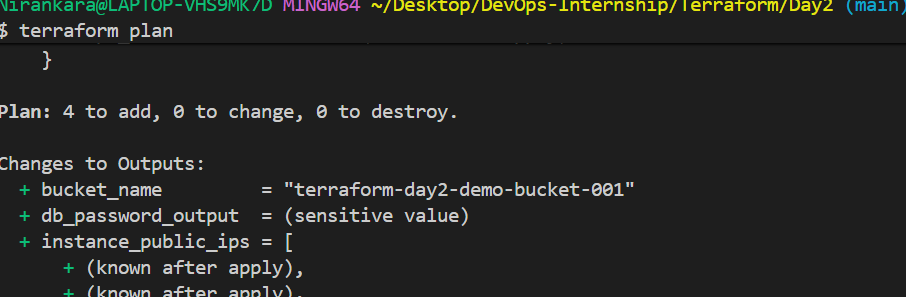

## 6. Terraform Apply
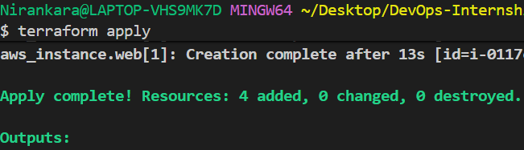

## 7. Terraform Outputs
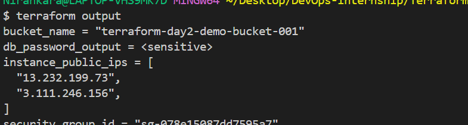

## 8. EC2 Instances Running
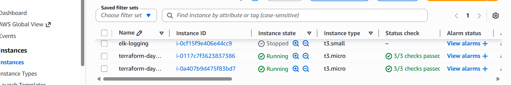

## 9. S3 Bucket Created
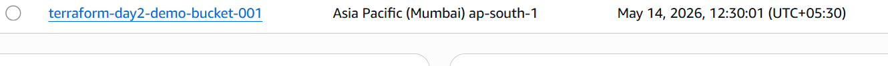

## 10. Security Group Rules
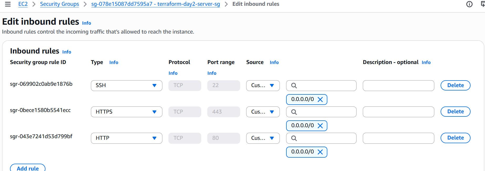

## 11. Terraform Destroy
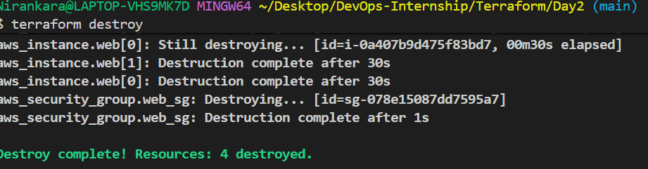

---

#  Terraform Commands Used

terraform init
terraform validate
terraform plan
terraform apply
terraform destroy
---

#  Conclusion

This project demonstrates a complete Terraform workflow in AWS:

**Write → Plan → Apply → Manage → Destroy**

It highlights real-world DevOps practices including:
- Infrastructure as Code (IaC)
- Remote state management
- Secure infrastructure design
- Automated provisioning using Terraform
---