# Terraform Day5 AWS Assessment

## Project Overview

This assessment demonstrates Infrastructure as Code (IaC) implementation using Terraform on AWS Cloud.

The goal of this project was to design reusable and modular Terraform code by creating separate modules for:

- VPC
- Subnet
- Security Group
- EC2 Instance
- S3 Bucket

The infrastructure was deployed using Terraform modules, dynamic blocks, lifecycle blocks, count, for_each, locals, outputs, and Terraform functions.

---

# Objective

The objective of this assessment was to:

- Learn modular Terraform architecture
- Deploy AWS infrastructure using reusable modules
- Implement dynamic and scalable Infrastructure as Code
- Use Terraform best practices
- Understand resource provisioning lifecycle
- Practice Git and GitHub workflow

---

# AWS Resources Created

The following AWS resources were created:

| Resource | Purpose |
|---|---|
| VPC | Isolated network environment |
| Subnets | Public and private networking |
| Security Groups | Firewall rules for EC2 |
| EC2 Instances | Virtual machines |
| S3 Buckets | Object storage |

---

# Terraform Concepts Used

## Modules
Separate modules were created for:
- VPC
- Subnet
- Security Group
- EC2
- S3

This improves:
- reusability
- maintainability
- scalability

---

## count
Used in:
- EC2
- Security Group
- S3 Bucket

Purpose:
- Create multiple resources dynamically

Example:
```hcl
count = 2
```

---

## for_each

Used in:
- VPC
- Subnet

Purpose:
- Create resources using key-value mapping

---

## Dynamic Blocks

Used in:
- Security Group ingress rules

Purpose:
- Dynamically create multiple security rules without repeating code

---

## Locals

Used in:
- Naming conventions
- Common tags
- Complex reusable values

Purpose:
- Reduce code duplication

---

## Lifecycle Block

Used lifecycle block with:

```hcl
prevent_destroy = true
```

Purpose:
- Prevent accidental deletion of important resources

---

# Terraform Functions Used

| Function | Purpose |
|---|---|
| merge() | Combine common and custom tags |
| lower() | Convert bucket names to lowercase |
| values() | Extract values from maps |
| count.index | Generate unique names |

---

# Naming Convention

All resources followed the naming convention:

```text
<prefix>-<resource>-<environment>-001
```

Examples:
- vpc-app-dev-001
- ec2-app-dev-001
- s3-app-dev-001

---

# Tags Applied

The following tags were applied to all resources:

```hcl
managedBy = "Saroj"
deploymentMode = "terraform"
```

Purpose:
- Resource identification
- Cost tracking
- Governance

---

# Folder Structure

```text
Day5-Assessment/
│
├── main.tf
├── variables.tf
├── outputs.tf
├── locals.tf
├── versions.tf
├── README.md
├── .gitignore
│
├── modules/
│   ├── vpc/
│   ├── subnet/
│   ├── sg/
│   ├── ec2/
│   └── s3/
│
└── screenshots/
```

---

# Step-by-Step Implementation

## Step 1 — Created Project Structure

Created module folders and Terraform files.

### Screenshot
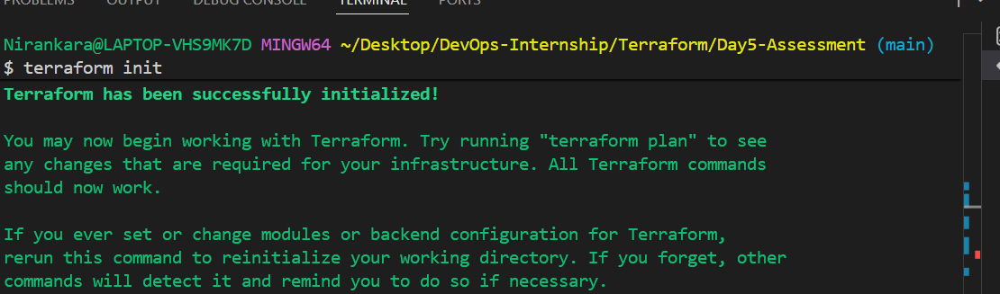

---

## Step 2 — Configure Terraform Modules

Created reusable Terraform modules for:
- VPC
- Subnet
- Security Group
- EC2
- S3

### Screenshot
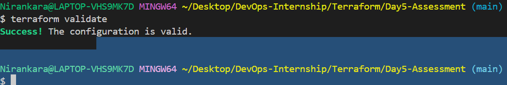

---

## Step 3 — Configure Subnet Module

Implemented subnet resources using:
- for_each
- variable-driven CIDR blocks

### Screenshot
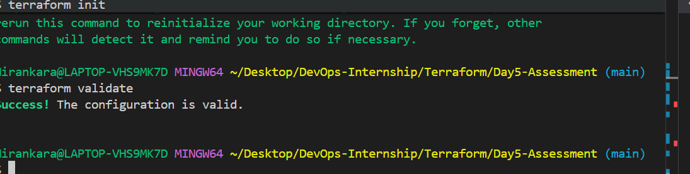

---

## Step 4 — Configure Security Group Module

Implemented:
- dynamic blocks
- ingress security rules

### Screenshot
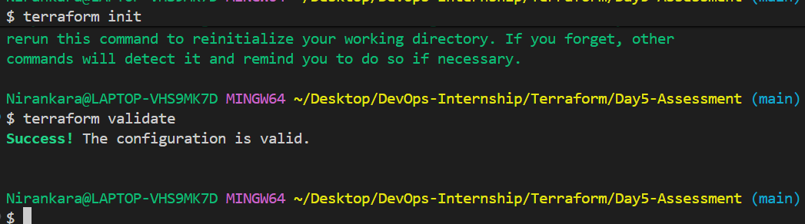

---

## Step 5 — Configure EC2 Module

Created EC2 instances using:
- count
- lifecycle block
- tags

### Screenshot
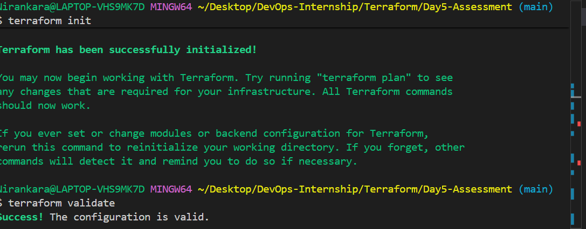

---

## Step 6 — Configure S3 Module

Created S3 buckets using:
- count
- naming convention
- lifecycle block

### Screenshot
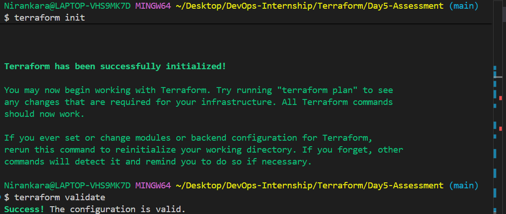

---

## Step 7 — Terraform Plan

Executed:

```bash
terraform plan
```

Purpose:
- Preview infrastructure changes before deployment

### Screenshot
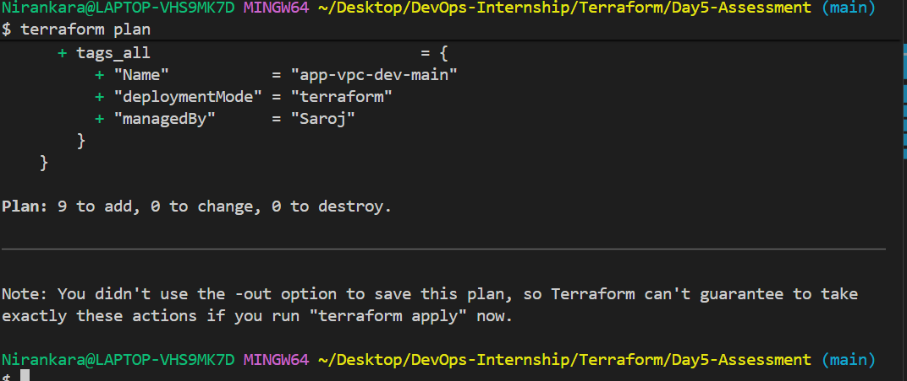


---

## Step 8 — Initial Apply Error

During deployment, EC2 creation failed because the selected instance type was not Free Tier eligible.

### Error
- InvalidParameterCombination

### Resolution

Changed instance type to:

```text
t3.micro
```

### Screenshot
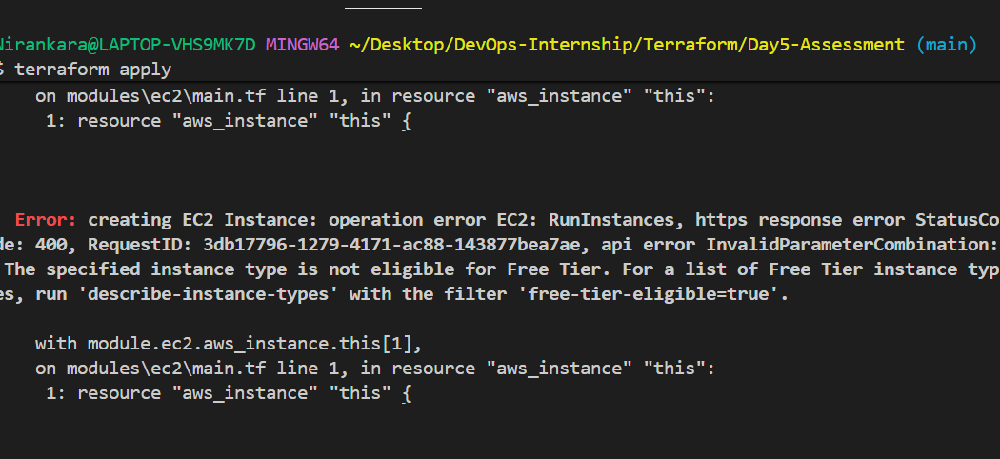

---

## Step 9 — Recovery Plan

Re-ran Terraform plan after correcting EC2 instance type.

### Screenshot
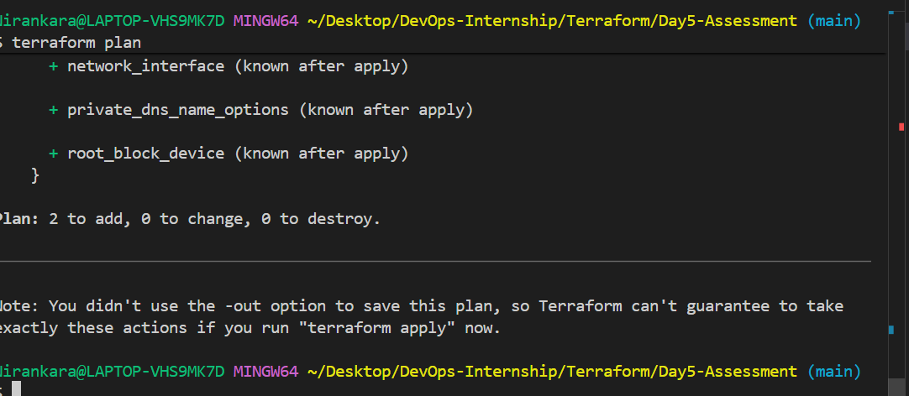


---

## Step 10 — Successful Deployment

Executed:

```bash
terraform apply
```

Infrastructure was deployed successfully.

### Screenshot
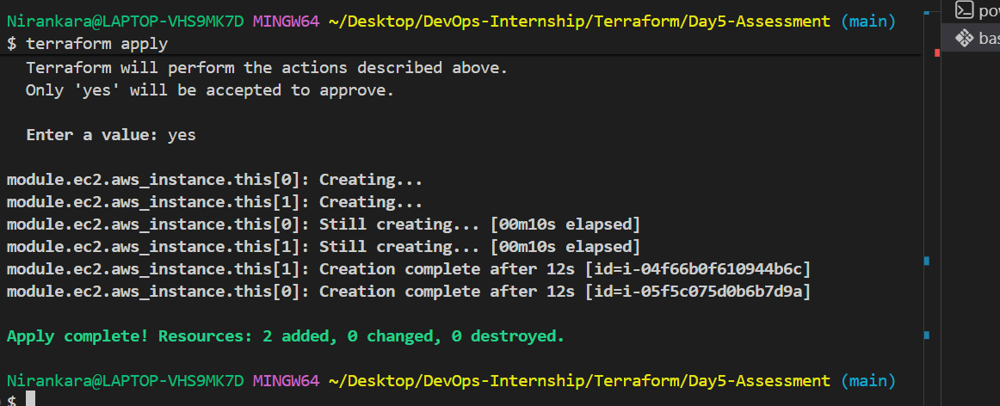


---

# AWS Resource Verification

## VPC Verification

Verified VPC creation in AWS Console.

### Screenshot
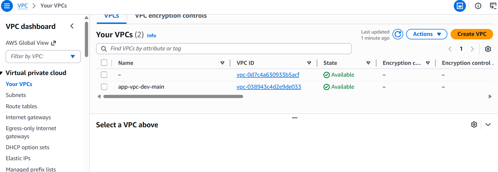


---

## Subnet Verification

Verified public and private subnets.

### Screenshot
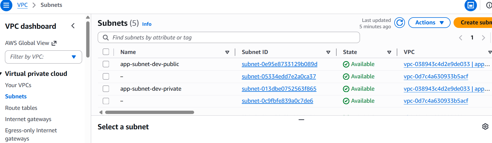


---

## Security Group Verification

Verified ingress rules created using dynamic blocks.

### Screenshot
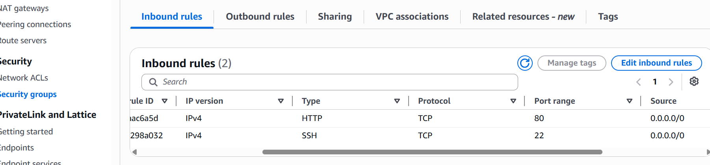


---

## EC2 Verification

Verified running EC2 instances.

### Screenshot
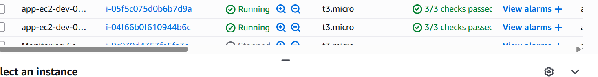

---

## S3 Bucket Verification

Verified S3 bucket creation.

### Screenshot
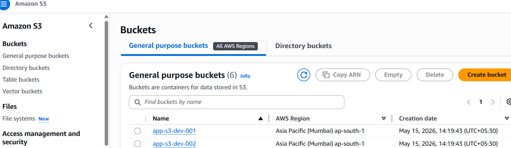


---

## Terraform State Verification

Executed:

```bash
terraform state list
```

Purpose:
- Verify Terraform-managed infrastructure resources

### Screenshot
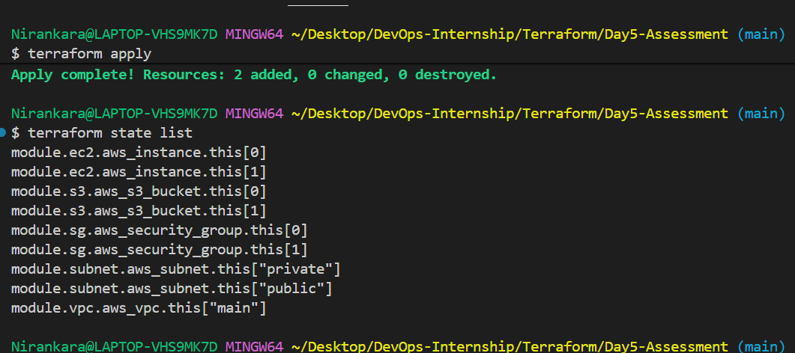

---

# Terraform Commands Used

## Initialize Terraform

```bash
terraform init
```

## Validate Configuration

```bash
terraform validate
```

## Preview Infrastructure

```bash
terraform plan
```

## Deploy Infrastructure

```bash
terraform apply
```

## View Terraform State

```bash
terraform state list
```

## Cleanup Infrastructure

```bash
terraform destroy
```

---

# Challenges Faced

## EC2 Free Tier Issue

### Problem

Selected instance type was not supported under AWS Free Tier.

### Solution

Changed instance type to:

```text
t3.micro
```

---

# Key Learnings

Through this assessment I learned:

- Terraform modular architecture
- Dynamic Infrastructure as Code
- AWS resource provisioning
- Terraform lifecycle management
- State management
- Reusable Terraform design

---

# Conclusion

This assessment successfully implemented a modular and reusable Terraform-based AWS infrastructure using Infrastructure as Code best practices.

The project demonstrated:
- automation
- scalability
- maintainability
- reusable cloud infrastructure deployment

---

